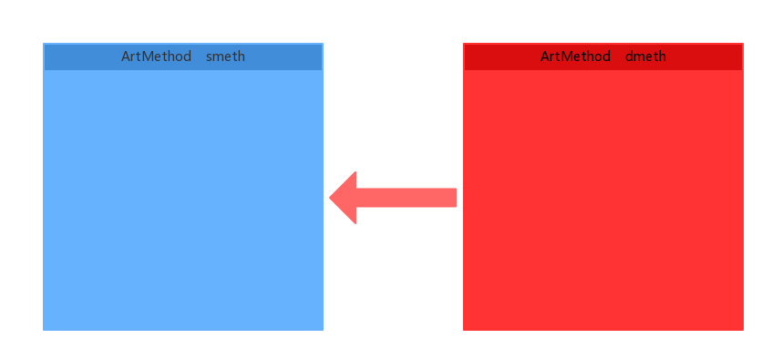

# JAndFix

### 简述
* JAndFix是一种基于Java实现的Android实时热修复方案，它并不需要重新启动就能生效。JAndFix是在AndFix的基础上改进实现，AndFix主要是通过jni实现对method（ArtMethod）结构题内容的替换。JAndFix是通过Unsafe对象直接操作Java虚拟机内存来实现替换。

### 原理
* 为何JAndfix能够做到即时生效呢？
原因是这样的，在app运行到一半的时候，所有需要发生变更的Class已经被加载过了，在Android上是无法对一个Class进行卸载的。而腾讯系的方案，都是让Classloader去加载新的类。如果不重启，原来的类还在虚拟机中，就无法加载新类。因此，只有在下次重启的时候，在还没走到业务逻辑之前抢先加载补丁中的新类，这样后续访问这个类时，就会Resolve为新的类。从而达到热修复的目的。JAndfix采用的方法是，在已经加载了的类中直接拿到Method（ArtMethod）在JVM的地址，通过Unsafe直接修改Method（ArtMethod）地址的内容，是在原来类的基础上进行修改的。我们这就来看一下JAndfix的具体实现。

#### 虚拟机调用方法的原理
为什么这样替换完就可以实现热修复呢？这需要从虚拟机调用方法的原理说起。在Android 6.0，art虚拟机中ArtMethod的结构是这个样子的：

```
@art/runtime/art_method.h

class ArtMethod FINAL {
 ... ...

 protected:
  // Field order required by test "ValidateFieldOrderOfJavaCppUnionClasses".
  // The class we are a part of.
  GcRoot<mirror::Class> declaring_class_;

  // Short cuts to declaring_class_->dex_cache_ member for fast compiled code access.
  GcRoot<mirror::PointerArray> dex_cache_resolved_methods_;

  // Short cuts to declaring_class_->dex_cache_ member for fast compiled code access.
  GcRoot<mirror::ObjectArray<mirror::Class>> dex_cache_resolved_types_;

  // Access flags; low 16 bits are defined by spec.
  uint32_t access_flags_;

  /* Dex file fields. The defining dex file is available via declaring_class_->dex_cache_ */

  // Offset to the CodeItem.
  uint32_t dex_code_item_offset_;

  // Index into method_ids of the dex file associated with this method.
  uint32_t dex_method_index_;

  /* End of dex file fields. */

  // Entry within a dispatch table for this method. For static/direct methods the index is into
  // the declaringClass.directMethods, for virtual methods the vtable and for interface methods the
  // ifTable.
  uint32_t method_index_;

  // Fake padding field gets inserted here.

  // Must be the last fields in the method.
  // PACKED(4) is necessary for the correctness of
  // RoundUp(OFFSETOF_MEMBER(ArtMethod, ptr_sized_fields_), pointer_size).
  struct PACKED(4) PtrSizedFields {
    // Method dispatch from the interpreter invokes this pointer which may cause a bridge into
    // compiled code.
    void* entry_point_from_interpreter_;

    // Pointer to JNI function registered to this method, or a function to resolve the JNI function.
    void* entry_point_from_jni_;

    // Method dispatch from quick compiled code invokes this pointer which may cause bridging into
    // the interpreter.
    void* entry_point_from_quick_compiled_code_;
  } ptr_sized_fields_;

... ...
}
```

这其中最重要的字段就是entry_point_from_interprete_和entry_point_from_quick_compiled_code_了，从名字可以看出来，他们就是方法的执行入口。我们知道，Java代码在Android中会被编译为Dex Code。
art中可以采用解释模式或者AOT机器码模式执行。

解释模式，就是取出Dex Code，逐条解释执行就行了。如果方法的调用者是以解释模式运行的，在调用这个方法时，就会取得这个方法的entry_point_from_interpreter_，然后跳转过去执行。

而如果是AOT的方式，就会先预编译好Dex Code对应的机器码，然后运行期直接执行机器码就行了，不需要一条条地解释执行Dex Code。如果方法的调用者是以AOT机器码方式执行的，在调用这个方法时，就是跳转到entry_point_from_quick_compiled_code_执行。

AndFix的方法替换其本质是ArtMethod指针所指内容的替换。


变成了这样的整体替换


由Unsafe来实现相当于:

```
	//src means source ArtMethod Address,dest mean destinction ArtMethod Address
    private void replaceReal(long src, long dest) throws Exception {
        int methodSize = MethodSizeUtils.methodSize();
        int methodIndexOffset = MethodSizeUtils.methodIndexOffset();
        //methodIndex need not replace,becase the process of finding method in vtable need methodIndex
        int methodIndexOffsetIndex = methodIndexOffset / 4;
        //why 1? index 0 is declaring_class, declaring_class need not replace.
        for (int i = 1, size = methodSize / 4; i < size; i++) {
            if (i != methodIndexOffsetIndex) {
                int value = UnsafeProxy.getIntVolatile(dest + i * 4);
                UnsafeProxy.putIntVolatile(src + i * 4, value);
            }
        }
    }
```

so easy,JAndFix就这样完成了方法替换。值得一提的是，由于忽略了底层ArtMethod结构的差异，对于所有的Android版本都不再需要区分，而统一以Unsafe实现即可，代码量大大减少。即使以后的Android版本不断修改ArtMethod的成员，只要保证ArtMethod数组仍是以线性结构排列，就能直接适用于将来的Android 8.0、9.0等新版本，无需再针对新的系统版本进行适配了。事实也证明确实如此，当我们拿到Google刚发不久的Android O(8.0)开发者预览版的系统时。

### 对比方案

|名字|公司|实现语言|及时生效|方法替换|方法的增加减少|Android版本|机型|性能损耗|补丁大小|回滚|易用性|
|---:|:---:|:---:|:---:|:---:|:---:|:---:|:---:|:---:|:---:|:---:|:---:|
|JAndFix|阿里天猫|JAVA|支持|支持|不支持|4.0+|ALL|小|小|支持|好|
|AndFix|阿里支付宝|C|支持|支持|不支持|4.0+|极少部分不支持|小|小|支持|好|
|Tinker|腾讯|JAVA|不支持|支持|支持|ALL|ALL|小|小|不支持|好|
|Robust|美团|JAVA|支持|不支持|不支持|ALL|ALL|大|小|支持|差（需要反射调用,需要打包插件支持）|
|Dexposed|个人|C|支持|支持|不支持|4.0+|部分不支持|小|小|支持|差（需要反射调用）|

### 如何使用

```
     try {
            Method method1 = Test1.class.getDeclaredMethod("string");
            Method method2 = Test2.class.getDeclaredMethod("string");
            MethodReplaceProxy.instance().replace(method1, method2);
        } catch (Exception e) {
            e.printStackTrace();
        }
```

### Running DEMO
* 把整个项目放入你的IDE即可（Android Studio）

### 注意
#### Proguard
```
-keep class com.tmall.wireless.jandfix.MethodSizeCase { *;}
```

### 解释实现
* 我以Android Art 6.0的实现来解释为什么这样实现就可实现方法替换
 
```
package com.tmall.wireless.jandfix;

import java.lang.reflect.Field;
import java.lang.reflect.Method;

/**
 * Created by jingchaoqinjc on 17/5/15.
 */

public class MethodReplace6_0 implements IMethodReplace {

    static Field artMethodField;

    static {
        try {
            Class absMethodClass = Class.forName("java.lang.reflect.AbstractMethod");
            artMethodField = absMethodClass.getDeclaredField("artMethod");
            artMethodField.setAccessible(true);
        } catch (Exception e) {
            e.printStackTrace();
        }
    }


    @Override
    public void replace(Method src, Method dest) {
        try {
            long artMethodSrc = (long) artMethodField.get(src);
            long artMethodDest = (long) artMethodField.get(dest);
            replaceReal(artMethodSrc, artMethodDest);
        } catch (Exception e) {
            e.printStackTrace();
        }
    }

    private void replaceReal(long src, long dest) throws Exception {
    	// ArtMethod struct size
        int methodSize = MethodSizeUtils.methodSize();
        int methodIndexOffset = MethodSizeUtils.methodIndexOffset();
        //methodIndex need not replace,becase the process of finding method in vtable
        int methodIndexOffsetIndex = methodIndexOffset / 4;
        //why 1? index 0 is declaring_class, declaring_class need not replace.
        for (int i = 1, size = methodSize / 4; i < size; i++) {
            if (i != methodIndexOffsetIndex) {
                int value = UnsafeProxy.getIntVolatile(dest + i * 4);
                UnsafeProxy.putIntVolatile(src + i * 4, value);
            }
        }
    }
}

```
1.declaring_class不能替换，为什么不能替换，是因为JVM去调用方式时很多地方都要对declaring_class进行检查。替换declaring_class会导致未知的错误。
2.methodIndex 不能替换，因为public proected等简介寻址的访问权限，本质在寻找方法的时候会查找virtual_methods_，而virtual_methods_是个ArtMethod数组对象，需要通过methodIndex来查找，如果你的methodIndex不对会导致方法寻址出错。
3.为什么AbstractMethod类中对应的artMethod属性的值可以作为c层ArtMethod的地址直接使用？看源码：

```
@@art/mirror/abstract_method.cc
ArtMethod* AbstractMethod::GetArtMethod() {
  return reinterpret_cast<ArtMethod*>(GetField64(ArtMethodOffset()));
}

@@art/mirror/abstract_method.h
static MemberOffset ArtMethodOffset() {
    return MemberOffset(OFFSETOF_MEMBER(AbstractMethod, art_method_));
  }
```
从源码可以看出C层在获取ArtMethod的地址，实际上就是把AbstractMethod的artMethod强制转换成了ArtMethod*指针，及我们在Java拿到的artMethod就是c层ArtMethod的实际地址。是不是很简单。

### 参考
* [Unsafe](http://mishadoff.com/blog/java-magic-part-4-sun-dot-misc-dot-unsafe/)
* [AndFix](https://github.com/alibaba/AndFix)

### License
[Apache License, Version 2.0](http://www.apache.org/licenses/LICENSE-2.0.html])

Copyright (c) 2017, alibaba-inc.com
